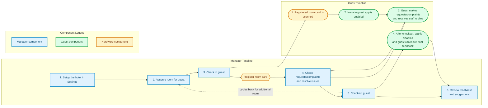

# Nova System Flowchart

```mermaid
flowchart LR
    %% Manager Timeline
    subgraph MGR[Manager Timeline]
        direction LR
        M1[1. Setup the hotel in Settings]
        M2[2. Reserve room for guest]
        M3[3. Check in guest]
        HREG{{Register room card}}
        M4[4. Check requests/complaints\nand resolve issues]
        M5[5. Checkout guest]
        M6[6. Review feedbacks\nand suggestions]
    end

    %% Guest Timeline
    subgraph GST["Guest Timeline"]
        direction LR
        G1([1. Registered room card is scanned])
        G2([2. Nova in guest app is enabled])
        G3([3. Guest makes requests/complaints\nand receives staff replies])
        G4([4. After checkout, app is disabled\nand guest can leave final feedback])
    end

    %% Manager flow
    M1 --> M2 --> M3 --> HREG --> M4 --> M5 --> M6
    M5 -. cycles back for additional room .-> M2

    %% Branch from manager step 3 to guest flow
    M3 --> G1 --> G2 --> G3

    %% Guest-manager interaction for requests/replies
    G3 --> M4
    M4 --> G3

    %% Checkout impact on guest flow
    M5 --> G4
    G4 --> M6

    %% Legend
    subgraph LEG[Component Legend]
        direction TB
        LM[Manager component]
        LG[Guest component]
        LH[Hardware component]
    end

    %% Visual coding by component
    classDef manager fill:#E0F2FE,stroke:#0284C7,stroke-width:2px,color:#0C4A6E;
    classDef guest fill:#DCFCE7,stroke:#16A34A,stroke-width:2px,color:#14532D;
    classDef hardware fill:#FEF3C7,stroke:#D97706,stroke-width:2px,color:#78350F;

    class M1,M2,M3,M4,M5,M6 manager;
    class G2,G3,G4 guest;
    class HREG,G1 hardware;
    class LM manager;
    class LG guest;
    class LH hardware;
```
